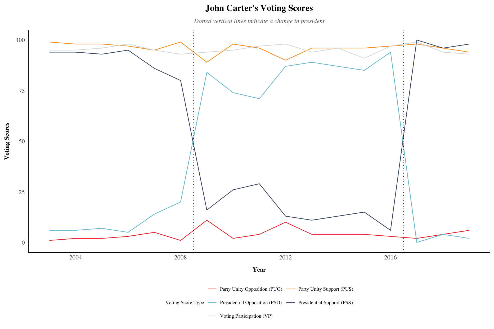
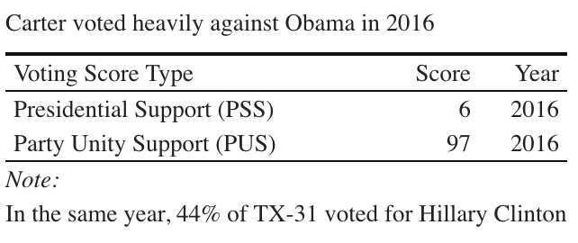

# Introduction

John Carter has represented the 31st Congressional District of Texas since its inception in 2003. At the beginning of his tenure, Carter safely won re-election, but changing demographics have led to closer elections in recent years. Nevertheless, the majority of the district continues to vote for him, even if that majority has narrowed over the years. John Carter may not offer dyadic[^defn-dyadic] representation to his geographic constituency, but he represents the substantive[^substantive] interests of the military and his co-partisans as he exercises considerable power with his seniority and committee assignments.

# Descriptive Characteristics of TX-31 and Carter

## Demographic overview

To gauge the quality of John Carter's actions as a representative, one must first consider the characteristics of the body he aims to represent. In summary, TX-31 is relatively White, wealthy, and Protestant. TX-31 has a majority White population, with an estimated 54% of the population identifying as non-Hispanic Whites. A sizable 25.3% of the population identifies as Hispanic. This figure falls below the Texas estimate of 39.7% but above the national figure of 18.4% (U.S. Census Bureau, 2019).

The district has a median household income higher than that of both the state and the nation. The median household in TX-31 makes approximately \$75,813, which sits at over \$10,000 greater than the state median of \$64,034 and the national median of \$65,712 (U.S. Census Bureau, 2019). 

Compared to the average of all congressional districts in the state, a smaller proportion of TX-31 belongs to a religious congregation. However, those with a congregation identify as mainline or evangelical Protestant at much higher rates (Setzler, 2016):

\bigskip

As a 79-year-old, White, Lutheran man with a law degree, the ten-term congressman fits the racial majority, religious plurality, and relative wealth of his constituency. His educational level puts him above average: Carter has a J.D. from the University of Texas, which puts him in the 12.3% of his district with a professional degree. Before serving as the representative for TX-31, Carter served as a Williamson County District Court judge from 1981-2000. From this, it seems that Carter does a fair job of descriptively representing the median constituent, despite his professional and education gap.[^white-collar]

## Local industry and Carter's staff

The most popular civilian industries and occupations of TX-31 parallel the makeup of Texas and the nation as a whole: all three levels of geography have the most popular occupational category of “Management, business, science, and arts occupations” and the most popular industry of “Educational services, and health care and social assistance.” In terms of notable employers, the Baylor Scott & White system has hospitals and clinics across the district, with large medical complexes in both Temple and Round Rock, TX. Additionally, Dell Technologies has its headquarters in John Carter’s hometown of Round Rock, TX. Two of Carter’s former staffers, one from his congressional office and the other from the House Appropriations Committee, have lobbied for Dell, the top contributor to his campaign committee from 2001-2020 (Legistorm, n.d.). While people may have mixed emotions about the blurred line between lobbying and Carter's campaign staff, that does show that Carter keeps local industries in mind while in Washington.

## Fort Hood and Carter's committee appointments

Pivoting away from civilian life, TX-31 has a large military presence, explained by its location on the border of Fort Hood. In 2019, the ACS estimated that 12.2% of the 18+ population in TX-31 is a civilian veteran, which nearly doubles the state’s veteran share of the adult population of 6.5% and the national estimate of 6.9%. In a similar vein, 2.7% of the 16+ labor force works in the armed forces, which is over five times the state and national values of 0.5%.

Carter holds several leadership roles that give him power in securing funds for the district, particularly regarding the military. Due to his relatively long tenure in Congress, Carter's seniority gives him an edge. Representatives with higher levels of seniority generally receive priority in leadership positions and benefit from an advantage in passing legislation (Taylor, 2019). In addition to the broad power of seniority, Carter sits on the Appropriations Committee, which is widely regarded as one of the most powerful committees in Congress (University of Minnesota, 2016). 

Within this exclusive committee appointment, Carter holds positions focused on the military. Carter ranks as the top Republican on the Military Construction and Veterans Affair Subcommittee on Appropriations. In addition to his leadership role, he sits on the Defense Subcommittee of Appropriations. Outside of his committee positions, he has served as the co-chair of the bipartisan House Army Caucus for the past five terms (Carter, n.d.). 

These military-specific appointments provide evidence of the *gains from trade* theory of committees, which posits that interested members dominate policymaking in specific areas and reap electoral benefits as a result (Stewart, 2012). In this case, John Carter focuses on military-related policy and likely reaps electoral gains from people who view his actions favorably. If this military focus does help him win re-election, then this electoral boost further cements his seniority in Congress. Then, increased seniority gives him greater leadership, further bolstering his power and the potential electoral gains.[^gains] Carter has considerable power from his leadership positions and seniority,[^informal] which allows him to secure funds for and represent the specific interests of the district.

## Industries that support John Carter

Several top industry donors to Carter's campaign committee have geographic or personal ties to the district (The Center for Responsive Politics, n.d.). Dell Technologies, based in Carter's hometown of Round Rock, contributed a total of \$10,727 to John Carter's campaign in the 2020 cycle, making them the 10th highest donor for that cycle. However, they rank as the top individual contributor to Carter's campaigns over his congressional career. The McLane Group[^mclane], a holding company[^mclane-holdings] based in Temple, TX, also ranks as a top contributor to Carter's campaigns. In the 2019-2020 election cycle, the McLane Group contributed a total of \$11,000 to John Carter's campaign committee, making them the 7th highest donor for that cycle. 

Even if donors do not have personal or geographic ties to the district, many of them have an industry-related interest in Carter. Several of his top donors work in defense-related industries.[^defense-donors] While these corporations may not have headquarters inside TX-31, their interest in Carter makes sense given his military-specific positions in policy and leadership. If Carter finds himself beholden to campaign donors, at least many of his top donors represent issues valued by his constituents and his district. Carter receives support from industries central to his district, which implies that these donors trust him to substantively represent their interests.

# Voting History

## Voting history of TX-31

While Carter has won re-election in every bid since 2002, the margins of the congressional and presidential races in TX-31 have narrowed in recent years. The changing demographics of Williamson County explain this leftward shift: the county's population has grown nearly 40% in the past decade (Perez, 2020). As a consequence of Austin's recent tech boom, people from California and New York have flooded the area. These new move-ins have priced many of the local, left-leaning Austinites out of their homes, forcing them to relocate to the neighboring, more affordable Williamson County (Marut, 2021). 

Carter recognizes the explosion of Austin as the root of this shift. At a 2018 campaign event, Carter joked about building a second wall between Williamson County and Travis County. He warned voters that if they "don't want people from Austin, liberals like the folks whom most of us moved up here to get away from, if you don't want them running... you gotta wake up with this election" (Livingston, 2018b).[^abbott-tweet]

Even in the face of these shifts, Carter generally performs better than the Republican presidential candidate and has continued to win re-election:

\bigskip

The 2020 election marked the first time since Carter's first election nearly two decades ago that the majority of TX-31 voted for the Democratic presidential candidate. Despite Biden winning the presidential race in the district, Carter maintained his Republican majority in the House race and secured his tenth term. The district re-elected Carter as its representative over his challenger Donna Imam, giving him 53.4% of the overall vote share and 54.7% of the two-party vote share. Over his numerous re-election campaigns, his closest race took place in 2018 against Democratic challenger MJ Hegar, where Carter scraped by with 50.6% of the overall vote and 51.5% of the two-party vote.

To date, Donna Imam and MJ Hegar rank as Carter’s most noteworthy challengers.[^hegar-senate] As young, progressive women, Carter's most recent and closest challengers differed from Carter in more than simple party affiliation. As a combat veteran, MJ Hegar likely appealed to many of the military interests in the district from Fort Hood and the surrounding areas. Imam, a computer engineer, lacked the military appeal possessed by Hegar and likely paid the price for that with decreased enthusiasm at the polls. Both women embraced platforms far more liberal than those of Carter, indicating that these sentiments appeal to a sizable portion of Carter's district. In addition to their shared ideology, both women noted that the people of TX-31 need high-quality representation rather than "absent titleholders" interested in playing "partisan football" (King, 2018). This raises the question, does Carter represent the more Democratic interests of his constituents in his actions, or does he succumb to the party pressures of the Republican Party?

## Voting history of John Carter

Despite having a relatively purple district, voting scores from Congressional Quarterly reveal that John Carter holds fast to his party loyalties (CQ Press, n.d.). In their scoring system, Congressional Quarterly defines *party unity* votes as those with each party's majority on opposing sides. The firm scores Carter's Party Unity Support at a median of 96 over his 18-year tenure, giving him a median Party Unity Opposition score of 4:[^median-scores] 

\bigskip

Trump received approximately 56% of TX-31's vote share in the 2016 election. Despite this even split, John Carter has Party Unity Support and Presidential Support scores of 97% and 6% respectively,[^obama] indicating that he aligns much more with his party than his constituency’s expressed preferences. Other analyses confirm that Carter offers disproportionate support to the Republican Party and Trump when compared to his district's support of Trump at the ballot box. 

FiveThirtyEight maintains tallies of how often members of Congress voted with or against Donald Trump's positions, and they used Trump's 2016 margin in the district to determine how often each representative should support the former president's position (Bycoffe, 2021). Since the 2016 election, John Carter has voted in line with Trump’s position 97.1% of the time. That figure stands 16.1% points higher than their model's prediction that he should only support Trump 81.0% of the time. This gap indicates that Carter sides with Trump on issues far more often than dictated by his constituents at the polls. 

From Congressional Quarterly's voting scores and FiveThirtyEight's analysis of his voting record, Carter appears to succumb to party pressures and vote along the party line even when his constituents would want him to vote less conservatively. Essentially, John Carter represents the Republicans of his district well. He directs most of his attention to his *primary supporters*, or those that will actively support Carter beyond the polls (Fenno, 1977). However, Carter does a rather poor job representing the interests of his non-Republican constituents, especially considering that a sizable portion of his geographic district voted against Trump in 2016 and the majority supported Biden in 2020.

Ideally, he would embrace more centrist ideology since his district has a pretty even split between Republicans and Democrats. The below plot maps DW-NOMINATE scores[^dw-meaning] of each representative as a function of their district's Republican vote share in the 2008, 2012, and 2016 presidential elections. The gap in Carter's voting record and district ideology indicates that Carter votes in a manner much more polarized than dictated by the partisan composition of his district. However, that seems to be the norm for representatives of both parties:[^dw-appendix]

\bigskip

Political science research provides some theoretical underpinnings for this pattern. As displayed in the above plots, members of Congress generally exhibit behaviors more extreme than their constituents. In fact, every Republican representative from Texas in the 109th Congress was more conservative than the median Republican voter in Texas. Similarly, every Democratic representative in Texas in that same Congress was more liberal than the median Democratic voter in the state (Bafumi & Herron, 2010). The *delegate paradox* helps to explain Carter’s behavior: voting with the median voter the entire time looks very extreme if the median preference on all bills is the same (Ahler & Broockman, 2018). In John Carter’s case, the congressional voter in his district voted for a Republican, so, if he voted with the median view on every issue, he would appear incredibly polarized. Perhaps John Carter is the best possible representative for the district; after all, he would likely appear even more polarized if he fit the “ideal” mold of the best issue delegate. 

Other evidence shows that a Democrat representative for TX-31, such as Donna Imam or MJ Hegar, would not do a better job of representing or responding to the interests of the district. Research indicates that responsiveness occurs through the adaptation of incumbent officials rather than through selecting a representative (Caughey & Warshaw, 2018). This finding suggests that selecting a new representative may not guarantee increased responsiveness to the changing opinions of TX-31.[^incumbent-challenger] Furthermore, while Carter holds views more conservative than the district as a whole, Hegar and Imam hold rather liberal views. In a phenomenon known as *leapfrog representation*, elections unseating the incumbent party often replace one relative extremist with an opposing extremist (Bafumi & Herron, 2010). So, while Carter does not represent his district's overall ideology, the polarization of Congress makes perfect congruence of any representative seem unlikely.

# Issue Priorities

## Communications about issue priorities

On a more granular level, John Carter advertises a pro-military, anti-establishment[^anti-establishment] stance in his communications. His official website emphasizes his “expertise on protecting the homeland, his commitment to our military and their families, and his integrity for taking care of veterans.” The only mention of specific legislation on his *About* page tells the backstory behind the Veteran Transplant Coverage Act. The press release portion of his website contains headlines such as “*Carter, Williams tell Biden No to housing illegal immigrants at Ft. Hood*,” “*Carter Votes to Give Pay Raise to America’s Troops*,” and “*Carter announces \$1.5 Million Federal grant for Robert Gray Army Airfield*.” These headlines indicate that Carter prioritizes appealing to his constituents with military ties.	

The messaging on his Twitter accounts parallels the subject matter on his website. The below word cloud displays some of the words most commonly used on his two Twitter accounts.[^twitter-methods] The common themes around his word choice are words involving local concerns like the military, such as “veterans,” “military,” “service,” and “Fort Hood” as well as words involving Texas-specific issues such as “border,” and words projecting his values and broad priorities such as “family,” “community,” and “funding.” His communications reflect the work he does in Congress regarding the military, the border, and other Republican issues.

\bigskip

## Representation of issue priorities

### Substantive representation of military interests

As someone who has never actually served in the military, Carter makes up for the lack of descriptive representation by substantively representing the interests of his military population.[^carter-weakness] While the number of actual soldiers may make this demographic a minority in the district, a pro-military stance is also popular among Republicans, which comprise the majority of the district. As previously stated, Carter serves on the House Appropriations Committee, which controls approximately 40% of total federal spending every fiscal year (Carter, n.d.). Many press releases on Carter's official website boast the funding Carter secures for the military and other community interests, providing further evidence of the gains from trade theory. Most recently, Carter announced that he secured \$48.7 million in funding for Fort Hood in the fiscal year 2021 Military Construction and Veterans Affairs Subcommittee on Appropriations bill (Carter, 2020). His success in securing funding for the military indicates that he not only talks about working for the military, but he follows through with his actions.

### Actions regarding the border

While Carter cannot descriptively represent the quarter of his constituents that identify as Hispanic, he does still have the opportunity to substantively represent them in his actions. The Hispanic voting bloc is far from monolithic (Paz, 2020), so one cannot clearly label the quality of his substantive representation. However, many of his views on immigration may not make him very popular among those with undocumented friends and family.[^undocumented-vote] On issues regarding the border and immigration, Carter takes strong positions against the unlawful presence of immigrants, with little sympathy for those lacking citizenship. Most recently, Carter sponsored a bill to prohibit the use of military installations--Fort Hood in the case of his district--to house undocumented immigrants or those undergoing removal proceedings (Carter, 2021). He also co-sponsored a bill earlier in the year that requires U.S. Immigration and Customs Enforcement to detain an undocumented immigrant charged with a crime (Feenstra, 2021). 

Turning to data, Carter's hardline views on immigration offer substantive representation to a fair number of Texas voters, including a sizable portion of the Hispanic population. In a 2021 poll, 51% of all Texas voters agreed that undocumented immigrants living in the United States should face immediate deportation. While 47% of Hispanic voters disagreed with immediate deportation, a somewhat surprising 39% agreed (Ramsey, 2021). Carter's law-and-order approach to immigration offers little sympathy to undocumented immigrants, and most of his legislation on the matter focuses on criminalizing those without citizenship.[^illegal-alien] Carter substantively represents the constituents that share his views on immigration, which the data suggests may include some Hispanic voters.

### Representing his co-partisans

More broadly, Carter's dialogue and actions appeal to his co-partisans. Considering that the district has not overwhelmingly supported Carter in recent years--with Carter only winning 51.5% of the two-party popular vote in 2018--he focuses his attention on the desires of his primary and electoral supporters rather than his geographic district in its entirety. In a recent op-ed entitled *The Misnomer that is the “American Rescue Plan”*, Carter described the widely popular piece of legislation as using COVID “as a guise to push liberal pet projects that have no benefit to you” (Carter, 2021). He voted against the bill, saying that it only served the “wants of Pelosi, Majority Leader Chuck Schumer and President Biden”. This messaging paints Joe Biden as the enemy, ignoring the fact that the majority of the district voted to elect Biden. That considered, the conservative members of TX-31 have individual-level, dyadic representation from Carter himself. On the other hand, the more moderate voters and Democrats in his district must receive virtual representation from representatives of other districts (Weissberg, 1978).

# Conclusion

Carter has seen his home district undergo a leftward shift in recent years, but he has maintained a strict, Republican voting record through it all. Closer elections in recent years indicate that a growing minority of his district is comfortable with a Democrat taking the lead. However, a new representative would sacrifice the benefits of the seniority amassed by the ten-term congressman. Carter may not be the ideal representative for TX-31, but it is not clear that such an ideal representative exists. A more moderate Republican would not mirror the median voter, and a Democratic replacement would be too liberal for most voters. While his ideology and voting records do not perfectly align with his constituency in the aggregate, Carter exercises his considerable power to represent the substantive interests of his primary supporters, the military, and his co-partisans. 

\newpage

# Appendix

## Carter's DW-NOMINATE scores and district ideology

While Carter tends to vote more conservatively than predicted by his district’s partisanship, he is slightly less conservative than the average Texas Republican in Congress. John Carter's DW-NOMINATE score places him below the average Texas Republican in every term since he assumed office in 2003:
 
\bigskip

When rescaling DW-NOMINATE scores from a -1 to 1 scale to a 0-100 scale, John Carter has a score of 73.6%, while his district’s average Republican vote share in the 2008-2016 presidential elections was only at 56.4%. Out of context, this seems like he does not represent his district well. However, the plot in the section on Carter's voting history reveals that Carter fits in rather well with the overarching trend of MCs sacrificing congruence to side with their party.

## Twitter analysis & tweets from Imam and Hegar

The word cloud for John Carter's tweets and the below word clouds were created using the `rtweet` and `ggwordcloud` packages in R. To produce these plots, a function pulled the 3,000 most recent tweets from the respective Twitter accounts. Then, I removed any numbers or *stop words* that did not convey any special meaning about the person's priorities. These words were largely filler words such as *the* and *an* or neutral words such as *people* and *week*. After cleaning the data, I produced the plots. The size of each word indicates its relative frequency in his tweets.

For the below plots of Donna Imam and MJ Hegar's tweets, I restricted their timelines to the year before and the year of their race against Carter to focus on their dialogue during their campaigns. You can see that they focus more on topics such as "healthcare" and "insurance", which contrasts with Carter's emphasis on words such as "military" and "border". This should not come as a surprise given candidates' respective parties, but it does give a sense of what each candidate prioritized in their messaging to constituents.

\bigskip

\newpage

# References

\setlength{\parindent}{-0.2in}
\setlength{\leftskip}{0.2in}
\setlength{\parskip}{8pt}
\noindent

Acevedo, N. (2021, January 22). Biden seeks to replace “alien” with less “dehumanizing term” in immigration laws. NBC News. https://www.nbcnews.com/news/latino/biden-seeks-replace-alien-less-dehumanizing-term-immigration-laws-n1255350

Ahler, D. J., & Broockman, D. E. (2018). The Delegate Paradox: Why Polarized Politicians Can Represent Citizens Best. The Journal of Politics, 80(4), 1117–1133. https://doi.org/10.1086/698755

Bafumi, J., & Herron, M. C. (2010). Leapfrog Representation and Extremism: A Study of American Voters and Their Members in Congress. The American Political Science Review, 104(3), 519–542.

Ballotpedia. (n.d.). Texas’ 36th Congressional District. Ballotpedia. Retrieved April 29, 2021, from https://ballotpedia.org/Texas%27_36th_Congressional_District

Bycoffe, A. (2021, January 13). Tracking Congress In The Age Of Trump. FiveThirtyEight. https://projects.fivethirtyeight.com/congress-trump-score/

Carnes, N. (2015). White-Collar Government in the United States. Swiss Political Science Review, 21(2), 213–221. https://doi.org/10.1111/spsr.12165

Carter, J. (2012, December 3). About. Congressman John Carter. https://carter.house.gov/about

Carter, J. (2020, December 22). Carter Secures $48.7 million for Fort Hood, $60 million for Privatized Housing Oversight in FY21 Appropriations Bill. Congressman John Carter. https://carter.house.gov/press-releases/carter-secures-487-million-fort-hood-60-million-privatized-housing-oversight-fy21

Carter, J. (2021, March 3). Rep. Carter: The misnomer that is the “American Rescue Plan.” Congressman John Carter. https://carter.house.gov/taxonomy/term/4/rep-carter-misnomer-american-rescue-plan

Carter, J. (n.d.). Committee Assignments. Congressman John Carter. https://carter.house.gov/committee-assignments

Carter, J. R. (2021, April 28). H.R.2871 - 117th Congress (2021-2022): To prohibit the use of military installations to house aliens who do not have a lawful immigration status or are undergoing removal proceedings in the United States. (2021/2022) [Legislation]. https://www.congress.gov/bill/117th-congress/house-bill/2871

Caughey, D., & Warshaw, C. (2018). Policy Preferences and Policy Change: Dynamic Responsiveness in the American States, 1936–2014. American Political Science Review, 112(2), 249–266. https://doi.org/10.1017/S0003055417000533

Cover, A. D. (1977). One Good Term Deserves Another: The Advantage of Incumbency in Congressional Elections. American Journal of Political Science, 21(3), 523–541. https://doi.org/10.2307/2110580

CQ Press. (n.d.). Voting Scores, Carter, John: U.S. Political Stats. Retrieved April 29, 2021, from https://library-cqpress-com.ezp-prod1.hul.harvard.edu/uspoliticalstats/document.php?id=772576

Feenstra, R. (2021, March 2). H.R.1496 - 117th Congress (2021-2022): Sarah’s Law (2021/2022) [Webpage]. https://www.congress.gov/bill/117th-congress/house-bill/1496

Fenno, R. F. (1977). U.S. House Members in Their Constituencies: An Exploration. The American Political Science Review, 71(3), 883–917. https://doi.org/10.2307/1960097

Forbes. (2021, May 1). Drayton McLane, Jr. Forbes. https://www.forbes.com/profile/drayton-mclane-jr/

King, M. (2018, October 5). TX-31: MJ Hegar vs. John Carter. https://www.austinchronicle.com/news/2018-10-05/tx-31-mj-hegar-vs-john-carter/

Lax, J. R., & Phillips, J. H. (2012). The Democratic Deficit in the States. American Journal of Political Science, 56(1), 148–166.

LegiStorm. (n.d.). Rep. John Carter’s Revolving Door—LegiStorm. Retrieved April 26, 2021, from https://www-legistorm-com.ezp-prod1.hul.harvard.edu/pro/revolving_door_details/member_id/166/name/John_Carter.html

Livingston, A. (2018a, July 9). MJ Hegar raised $750,000 off her viral ad, one of a few Texas Democrats boasting big numbers. The Texas Tribune. https://www.texastribune.org/2018/07/09/mj-hegar-raised-750000-10-days-her-viral-ad/

Livingston, A. (2018b, August 31). U.S. Rep. John Carter prepares for tougher-than-usual race against MJ Hegar. The Texas Tribune. https://www.texastribune.org/2018/08/31/john-carter-mj-hegar-2018/

Marut, M. (2021, March 18). Data shows people moving to Austin from out of state able to price out Austinites looking to move within city. Kvue.Com. https://www.kvue.com/article/money/economy/boomtown-2040/buying-home-austin-texas-for-sale-boomtown-california-new-york-tesla/269-89c5f131-c2da-465f-b65c-c19530d282e7

McLane Group. (2020). McLane Group: A diverse portfolio. McLane Group. https://www.mclanegroup.com/portfolio/

Paz, C. (2020, October 29). What Liberals Don’t Understand About Pro-Trump Latinos. The Atlantic. https://www.theatlantic.com/politics/archive/2020/10/trump-latinos-biden-2020/616901/

Perez, P. (2020, October 19). Williamson County voter demographics changing as population grows. Kvue.Com. https://www.kvue.com/article/news/politics/vote-texas/williamson-county-voter-demographics-changing-as-population-grows/269-9baaa71b-22d4-44c3-b995-2a084e36aaa3

Ramsey, R. (2021, May 4). Texas voters are as concerned about border security as about the pandemic, UT/TT Poll finds. The Texas Tribune. https://www.texastribune.org/2021/05/04/texas-border-security-pandemic-poll/

Setzler, M. (2016). Religious Differences among Congressional Districts and the Success of Women Candidates. Politics & Gender, 12(03), 518–548. https://doi.org/10.1017/S1743923X15000616

Stewart, C. (2012). Committees in Congress. In Analyzing Congress, Second Edition (p. 347). W.W. Norton & Company.

Svitek, P. (2020, November 4). John Cornyn defeats MJ Hegar to retain U.S. Senate seat. The Texas Tribune. https://www.texastribune.org/2020/11/03/john-cornyn-mj-hegar-texas-senate/

Taylor, A. J. (2019). Legislative Seniority in the Partisan Congress*. Social Science Quarterly, 100(4), 1297–1307. https://doi.org/10.1111/ssqu.12616

The Center for Responsive Politics. (n.d.). Rep. John Carter Contributors 2001-2020—Texas District 31. OpenSecrets. Retrieved April 26, 2021, from https://www.opensecrets.org/members-of-congress/john-carter/contributors?cid=N00025095&cycle=CAREER&type=I

University of Minnesota. (2016). 12.6 Committees. In American Government and Politics in the Information Age. University of Minnesota Libraries Publishing edition, 2016. This edition adapted from a work originally produced in 2011 by a publisher who has requested that it not receive attribution. https://open.lib.umn.edu/americangovernment/chapter/12-6-committees/

U.S. Census Bureau. (2019). ACS Demographic and Housing Estimates. https://data.census.gov/cedsci/table?q=american%20community%20survey&g=5001600US4831&tid=ACSDP1Y2019.DP05

Van Kessel, P., Widjaya, R., Shah, S., Smith, A., & Hughes, A. (2020, July 16). 1. The congressional social media landscape. Pew Research Center: Internet, Science & Tech. https://www.pewresearch.org/internet/2020/07/16/1-the-congressional-social-media-landscape/

Voteview. (n.d.). Voteview | About us. Retrieved April 29, 2021, from https://voteview.com/about

Weissberg, R. (1978). Collective vs. Dyadic Representation in Congress. The American Political Science Review, 72(2), 535–547. https://doi.org/10.2307/1954109

---------------------------------------------------------------------------

[^defn-dyadic]: Dyadic representation refers to how a representative reflects the interests and preferences of their geographic constituency. In the case of Carter, he represents his strong supporters--or his primary supporters--well, but his actions do not accurately reflect the overall composition of his geographic constituency.

[^substantive]: Substantive representation focuses on the legislative actions of a representative, while descriptive representation has to do with the descriptive characteristics of a representative. These two can occur together, but having one form of representation does not guarantee the other. For example, a male representative does not descriptively represent females, but he can advocate for policy that suits their interests. Conversely, a female can advocate for policies that work against the best interests of women; this congresswoman descriptively represents females but does not offer substantive representation.

[^white-collar]: A body of political science research has taken note of a phenomenon called *white-collar government*, which refers to the disproportionate number of wealthy people and white=collar professionals in political office. As of 2014, members of Congress had a median net worth of approximately \$1.5 million, which is nearly 11 times the median net worth of American families (Carnes, 2015). While Carter's law degree may put him above the vast majority of his constituents in terms of education, that pattern does not seem unusual for Congress as a whole. Rather than serving as a weakness in Carter's individual-level descriptive representation, it represents a flaw in the system as a whole.

[^gains]: However, these electoral gains only last as long as he has a district that supports his military-focused work. The changing demographics and leftward shift of his constituency have likely dampened the effect of this electoral boost. He can only benefit from this if his electoral supporters outweigh those that want him out of office, and it is unclear how long that will last.

[^informal]: While Carter exercises above-average levels of power in his seniority and committee assignments, he ranks below the average Republican in his informal power through social media. In July of 2020, the median Republican member of Congress had just under 30K followers across their Twitter accounts, whereas John Carter had a total of 24.7K followers across his two accounts as of April 2021 (Van Kessel et al., 2020).

[^mclane-holdings]: The McLane Group's portfolio spans the realms of logistics, technology, food production, and automotive sales (McLane Group, 2020). In addition to these more traditional business ventures, Drayton McLane, Jr. owned the Houston Astros from 1993-2011. McLane amassed a great deal of wealth before he founded the McLane Group, however. In 1991, he sold McLane Co., his family's grocery distribution company that he turned into an international firm, to Sam Walton for \$50 million and 10.4 million shares of Walmart (Forbes, 2021). After this 1991 sale, McLane founded McLane Group. Today, his net worth stands around \$2.8 billion, making any campaign contributions negligible when compared to his massive wealth (Drayton McLane, Jr., 2021).

[^mclane]: The family that sits at the helm of the McLane Group has both personal and industry ties to Carter's district. The McLane Children's Hospital in Temple, TX lies within TX-31, and the McLane Football Stadium at Baylor University in Waco lies just outside of the district. While Drayton McLane Jr.'s hometown of Cameron lies outside of Carter's district, his son--Drayton McLane, III--lives in Salado with his family.

[^defense-donors]: To name a few, Raytheon Technologies, General Dynamics, L3Harris Technologies, and Leidos Inc all ranked as top contributors to Carter's campaign committee for the 2020 cycle.

[^twitter-methods]: Carter's two Twitter accounts were very similar in content and placing the two side-by-side was incredibly redundant. Because of that, I elected to combine the common words from his two accounts into a single word cloud. See the Appendix for a description of how I constructed this word cloud and for word clouds of the tweets of Carter's two most recent challengers.

[^carter-weakness]: As a combat veteran, MJ Hegar took advantage of Carter's lack of military experience in her campaign in 2018. She raised \$1.1 million in a single quarter of the year following the release of her viral biographical ad that outlined her service in the U.S. Air Force and Air National Guard (Livingston, 2018a).

[^dw-meaning]: Voteview's DW-NOMINATE scores place legislators on an ideological spectrum from -1 to 1 based on their voting record, with -1 representing the most liberal ideology and 1 representing the most conservative (Voteview, n.d.). DW-NOMINATE scores rely on voting records, so it serves as a rather imprecise gauge for a representative's actual ideology. Policy tends to be overresponsive to ideology and party, and since representatives vote on these policies that are inherently more polarized, the scores may not represent a representative's actual views (Lax & Phillips, 2012). However, DW-NOMINATE scores do represent the actions of a representative, which are arguably what matter most since crafting and passing policy is their job.

[^dw-appendix]: See the Appendix for further analysis of Carter's DW-NOMINATE scores and his district's ideology.

[^illegal-alien]: John Carter refers to undocumented immigrants as *illegal aliens* in his written materials. Several lawmakers--including President Biden and fellow Texas Representative Joaquin Castro--criticize the term for its dehumanizing connotations (Acevedo, 2021). While people may disagree with the use of the language, John Carter's choice of terminology does match the tone of his harsh stance on immigration policy.

[^abbott-tweet]: Other Republican lawmakers from the state share Carter's sentiments about newcomers arriving from other states. In a 2019 tweet, Greg Abbott wrote "You're welcome in Texas as long as you never forget why you fled a liberal state. Texans expect less government, lower taxes & more freedom. Newcomers must keep it that way." While Abbott referred to the state as a whole, a large number of newcomers from these more liberal flock to Austin for the reasons described above.

[^hegar-senate]: After her narrow loss to Carter in 2018, Hegar ran against Republican Senator John Cornyn in a much less narrow election than her previous House race, with Cornyn winning 53.5% of the overall vote and 54.9% of the two-party vote share (Svitek, 2020).

[^anti-establishment]: As someone on his tenth term in Congress, Carter seems like the exact kind of career politician that many Republicans in the Trump and post-Trump era love to hate. However, Carter makes an active effort to distance himself from this stereotype. On his *About* page, Carter writes that "Central Texas is home, and Washington is simply where he works." He then goes on to describe that he sleeps on a pull-out couch in his office in DC "and hops on the first flight back to God's Country after final votes" (Carter, 2012). 

[^undocumented-vote]: Since undocumented immigrants cannot vote, some may argue that he is not obliged to represent them. That debate is beyond the scope of this paper.

[^median-scores]: Because the president in power alternated between years, taking an average of the scores across Carter's terms would not have any real interpretation. However, the median president during Carter's reign has been a member of the Republican Party. With that, we can interpret the median presidential support as Carter's propensity to support a Republican president.

[^obama]: The 2016 Presidential Support score of 6 indicates that Carter rarely voted in line with Barack Obama, who was president at the time.

[^incumbent-challenger]: Perhaps a more moderate Republican would best represent the views of the constituency as a whole. However, a Republican challenger would face steep odds in the primary due to Carter's name recognition and other electoral benefits reaped as part of the incumbency advantage in House elections (Cover, 1977).

