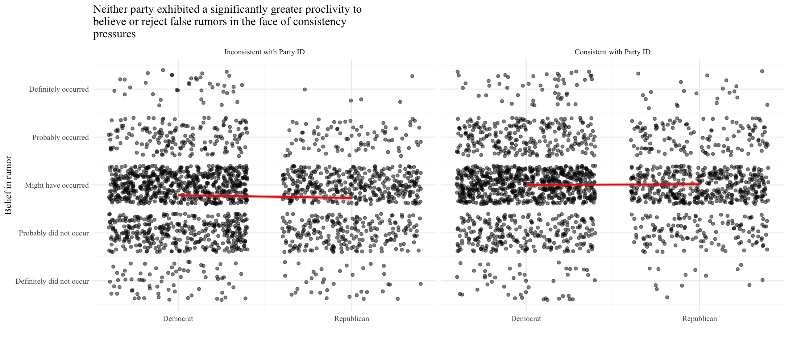
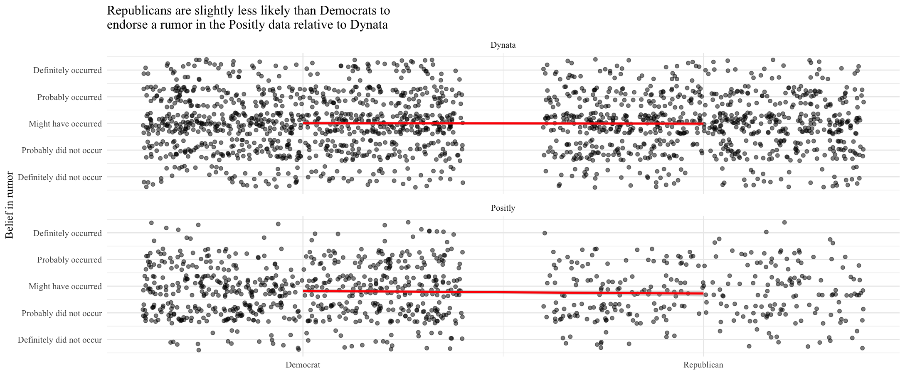

# Study Overview

## Introduction

With the prevalence of claims of election fraud and Q-Anon conspiracy theories, it seems as if Republican voters exhibit a greater tendency to believe false information. Does the prevalence of far-right conspiracy theories result from a greater supply of such rumors spread by the political elite or a greater likelihood of believing false information? Previous research about the propensity to accept false information does not differentiate between supply-side and demand-side explanations. In the case of misinformation, *supply-side* explanations have to do with the effectiveness of political elites in spreading such information, and *demand-side* explanations involve the likelihood of citizens believing false information upon receipt. This study focuses on the demand side and examines if Republicans exhibit a greater propensity to believe false political information (Ryan & Aziz, 2020).[^data-source]

## Methods

The original researchers conducted a carefully designed experiment to reveal any partisan asymmetries in the tendency to endorse false political information (Ryan & Aziz, 2020). The experiment utilized a probability-based, representative sample of Americans via the National Opinion Research Center's AmeriSpeak Panel. Participants reported their partisanship before the experiment. Researchers presented the following questions in a randomized order:
  
  + Ohio[^state-choice] item: Did [Party] legislators in Ohio accept laundered money from a group of Canadian Steel
manufacturers, hoping to improve their business dealings in the state? 
  + Wisconsin[^state-choice] item: Did Lucas Hofmann, a [Party] prosecutor in Wisconsin, plot with [same party] Party members to suppress evidence that Gerry Mason, a wealthy donor in the state, engaged in pedophilia?
  + Oil item: Was the price of crude oil higher on March 1, 2016 than on October 1, 2016? 
  
Researchers gave respondents five response options, scaled from $0 = \text{definitely did not occur}$ to $1 = \text{definitely occurred}$. The *oil item* served as a baseline to assess individuals' proclivity to agree with an apolitical survey item. Researchers randomly assigned a political party for the *Ohio item* and used the opposite political party in the *Wisconsin item*. To track if a rumor is consistent with the respondent's party identification, researchers crafted a *consistency* variable to indicate if the rumor is consistent with the participant's party identification.

Using the results of this experiment, the study authors examined the relationship between rumor endorsement and a respondent's partisanship, rumor consistency, and the interaction between the two variables using a simple OLS regression. This interaction term examines the crux of the research question: is either party more responsive to consistency pressures?

## Conclusion

Ultimately, the results from this study reveal that Democrats and Republicans endorse false information about political opponents at approximately the same rate. Therefore, the researchers failed to find sufficient evidence that Republicans exhibit a greater propensity to believe such rumors. These findings stand in contrast to the implications of previous findings that conservatism drives motivated cognition (Jost et al., 2018). One must note, however, that the researchers do not conclude that false beliefs exist in equal numbers among Democrats and Republicans. Rather, the study reveals that one side does not exhibit any underlying psychological mechanisms that make them more likely to accept false information in favor of their side. These results support the prevalence of political misinformation on the right exists as a result of a greater *supply* of false information rather than a greater *demand*.

# Replication[^github]

## Main Analysis

Before testing the actual research question, I replicated the previously described oil item to assess individuals' tendency to agree or disagree with an apolitical survey item. This simple regression maps the agreement with the oil item from party identification rescaled from 0 to 1, where Strong Democrat = 0 and Strong Republican = 1. The near-zero and insignificant party identification coefficient indicates that one's party has no bearing on his or her proclivity to agree with the statement about oil prices.

Preliminary Table: Both Parties Agree to Apolitical Statement at the Same Rate
================================================
                         Dependent variable:    
                     ---------------------------
                                 oil            
------------------------------------------------
Party Identification           -0.013           
                               (0.015)          
                                                
Intercept                     0.554***          
                               (0.009)          
                                                
------------------------------------------------
Observations                    2,036           
R2                             0.0003           
Adjusted R2                    -0.0001          
================================================
Note:                *p<0.1; **p<0.05; ***p<0.01

After confirming that neither party has a greater tendency to accept apolitical information at the baseline, I replicated the OLS regression examining the relationship between rumor endorsement and a respondent's partisanship. For thoroughness, the original researchers included several analyses. In its simplest form, researchers examined the Ohio and Wisconsin rumor separately. They also reported models including and excluding independents from partisan calculations, treating them as genuine partisans based on the party they lean toward in the analyses that include independents. I successfully replicated all regressions included in the main study.

Table 1: Democrats and Republicans are Equally Subject to Consistency Pressures
===============================================================================
                                          Dependent variable:                  
                        -------------------------------------------------------
                                    Belief in false political rumor            
                          Ohio     Ohio   Wisconsin Wisconsin  Pooled   Pooled 
                          (1)      (2)       (3)       (4)      (5)      (6)   
-------------------------------------------------------------------------------
Party-Consistent = 1    0.091*** 0.098*** 0.057***  0.052***  0.074*** 0.075***
                        (0.013)  (0.015)   (0.013)   (0.015)  (0.009)  (0.010) 
                                                                               
Republican = 1           0.008    -0.002   -0.008    -0.003   -0.0001   -0.003 
                        (0.014)  (0.016)   (0.014)   (0.016)  (0.010)  (0.011) 
                                                                               
Consistent * Republican                                        0.002    0.010  
                                                              (0.007)  (0.008) 
                                                                               
Wisconsin = 1            -0.015   -0.014    0.010     0.001    -0.003   -0.007 
                        (0.019)  (0.023)   (0.019)   (0.023)  (0.014)  (0.016) 
                                                                               
Intercept               0.421*** 0.419*** 0.442***  0.449***  0.431*** 0.429***
                        (0.009)  (0.011)   (0.009)   (0.010)  (0.007)  (0.008) 
                                                                               
-------------------------------------------------------------------------------
Partisan Leaners        Included Excluded Included  Excluded  Included Excluded
Observations             1,722    1,270     1,718     1,266    3,440    2,536  
R2                       0.044    0.051     0.024     0.017    0.033    0.032  
Adjusted R2              0.042    0.048     0.022     0.014    0.032    0.030  
===============================================================================
Note:                                               *p<0.1; **p<0.05; ***p<0.01

The results reveal that party randomization induced partisan bias, as respondents rated rumors as true at greater rates when they were consistent with their party identification. The insignificant, near-zero interaction terms, however, reveal that this relationship did not differ between the parties. Columns 5 and 6 pool the rumors together and reveal nearly identical partisan bias between Democrats and Republicans. The replicated results support the researchers' conclusion that Democrats and Republicans endorse false information about political opponents at approximately the same rate.

## Supplemental Information

Because the regressions from the main study replicated rather seamlessly, I elected to replicate several tables from the Supplemental Information (SI) portion of the study. Many of these secondary results document and detail a pre-registered replication study, referred to as Study 2. 

First, I replicated Table SI-2. This regression mirrors Table 1 but includes an additional interaction term to see if the interaction of party and consistency differs between the Dynata and Positly portions of Study 2. The researchers tasked two market research firms, Dynata and Positly, to recruit and survey respondents on their behalf. The main analysis pooled survey responses, and this regression aims to see if the relationship between Republican and party consistency varied among respondents from the two different surveys.

Unsurprisingly, the top row demonstrates a consistently positive effect of a party-consistent rumor among Democrats, exhibiting that Democrats exhibit consistency pressures to all rumors. The negative interaction terms demonstrate that Republicans exhibit differential responses to consistency pressures, and, if anything, Democrats are more susceptible to consistency pressures in this test. The original authors reconcile this discrepancy from the main text by hypothesizing that the out-party is more prone to believe false political information that favors their side. The initial study took place only one year into Trump's presidency. Study 2, however, took place in July 2019, which meant Democrats had spent almost two years away from the presidency. Regardless of the underlying mechanism, the researchers set out to answer whether or not the political right exhibited a greater propensity to believe false political information, and both the original study and Study 2 answer indicate the phenomenon is not unique to the political right.

Table SI-2: Results from Replication Study
==================================================================================
                                           Dependent variable:                    
                        ----------------------------------------------------------
                                     Belief in false political rumor              
                          Ohio     Ohio    Wisconsin Wisconsin  Pooled    Pooled  
                          (1)       (2)       (3)       (4)       (5)       (6)   
----------------------------------------------------------------------------------
Party-Consistent = 1    0.080*** 0.078***  0.117***  0.125***  0.098***  0.101*** 
                        (0.016)   (0.018)   (0.015)   (0.017)   (0.011)   (0.012) 
                                                                                  
Republican = 1           0.009    -0.016    0.041**   0.038*    0.024**    0.009  
                        (0.017)   (0.019)   (0.017)   (0.020)   (0.012)   (0.014) 
                                                                                  
Wisconsin = 1                                                    0.009     0.011  
                                                                (0.008)   (0.010) 
                                                                                  
Positly = 1             -0.032** -0.039*** -0.058*** -0.069*** -0.045*** -0.054***
                        (0.013)   (0.015)   (0.012)   (0.014)   (0.009)   (0.010) 
                                                                                  
Consistent * Republican  -0.025    0.005   -0.079*** -0.084*** -0.051*** -0.038** 
                        (0.024)   (0.028)   (0.024)   (0.027)   (0.017)   (0.020) 
                                                                                  
Intercept               0.450*** 0.457***  0.448***  0.451***  0.445***  0.449*** 
                        (0.012)   (0.014)   (0.012)   (0.014)   (0.009)   (0.011) 
                                                                                  
----------------------------------------------------------------------------------
Observations             1,721     1,364     1,720     1,363     3,441     2,727  
R2                       0.023     0.030     0.047     0.055     0.034     0.040  
Adjusted R2              0.021     0.027     0.045     0.053     0.032     0.039  
==================================================================================
Note:                                                  *p<0.1; **p<0.05; ***p<0.01

Next, Table SI-3 replaces the party identification variable from the main analysis with a conservative indicator constructed from the 7-point ideology score. Because nearly half of respondents reported their ideology as "middle of the road," this analysis draws from a much smaller sample size. The interaction term does not provide support for any ideological asymmetry in believing the rumor.

Table SI-3: Ideology Does not Moderate Consistency Effects
===========================================================
                                 Dependent variable:       
                          ---------------------------------
                           Belief in false political rumor 
                             Ohio     Wisconsin    Pooled  
                              (1)        (2)        (3)    
-----------------------------------------------------------
Ideology-consistent = 1    0.069***    0.096***   0.083*** 
                            (0.019)    (0.019)    (0.014)  
                                                           
Conservative = 1            -0.013     0.041**     0.015   
                            (0.019)    (0.018)    (0.013)  
                                                           
Wisconsin = 1                                      0.001   
                                                  (0.009)  
                                                           
Consistent * Conservative    0.004     -0.045*     -0.021  
                            (0.027)    (0.026)    (0.019)  
                                                           
Intercept                  0.440***    0.412***   0.423*** 
                            (0.014)    (0.013)    (0.017)  
                                                           
-----------------------------------------------------------
Observations                 1,012      1,008      2,020   
R2                           0.028      0.035      0.030   
Adjusted R2                  0.026      0.032      0.028   
===========================================================
Note:                           *p<0.1; **p<0.05; ***p<0.01

Table SI-4 combines the approaches of Table SI-2 and Table SI-3 by using Study 2 data and ideology. This regression yields very similar results to Table SI-2. The regression revealed no clear asymmetry for the Ohio item, but showed that liberals are slightly more susceptible to consistency pressures for the Wisconsin item, as demonstrated by the significant, negative interaction terms.

Table SI-4: Ideology and Consistency in Study 2
===========================================================
                                 Dependent variable:       
                          ---------------------------------
                           Belief in false political rumor 
                             Ohio     Wisconsin    Pooled  
                              (1)        (2)        (3)    
-----------------------------------------------------------
Ideology-consistent = 1    0.082***    0.127***   0.104*** 
                            (0.017)    (0.017)    (0.012)  
                                                           
Conservative = 1            -0.017      0.024      0.003   
                            (0.018)    (0.019)    (0.013)  
                                                           
Wisconsin = 1                                      0.008   
                                                  (0.009)  
                                                           
Consistent * Conservative   -0.023    -0.078***  -0.050*** 
                            (0.027)    (0.026)    (0.019)  
                                                           
Intercept                  0.450***    0.430***   0.437*** 
                            (0.012)    (0.012)    (0.010)  
                                                           
-----------------------------------------------------------
Observations                 1,438      1,434      2,872   
R2                           0.024      0.043      0.033   
Adjusted R2                  0.022      0.041      0.031   
===========================================================
Note:                           *p<0.1; **p<0.05; ***p<0.01

# Proposed Extensions

## Visualizations

The replications of the Supplemental Information analyses cover many of the possible extensions with the given data, such as examining ideology rather than party or examining the differences between the two survey firms. However, both the main analysis and the Supplemental Information lacked any sort of visualization aside from regression tables. Graphs tell a clear story that is sometimes buried inside of regression tables, and they aid in the ease of reading for less-focused readers. For that reason, I created the below plot to visualize the relationship or lack thereof between partisanship and propensity to believe false rumors. The nearly horizontal lines on the plots reveal that there is little to no partisan difference in believing the rumors.

Similarly, the following plot shows little to no difference in the results from the two firms that conducted the surveys in Study 2:

## Examining Religious Differences

This paper focused on the partisan differences in proclivity to believe false information. An interesting extension to this would examine the asymmetries in the propensity of different religious groups to endorse false political information. Many religions have their foundations on stories that seem unlikely to occur in the modern world, and the metaphorical nature of religion requires that you accept things that you cannot see (Shapiro, 2017). To examine the relationship between religious subgroups and the propensity to accept false information, I will add a religion term to the regression from Table 1 to see if any religious groups exhibited a greater proclivity to accept false information.

Table 1.1: Some Religious Groups Are More Likely to Accept False Information
=====================================================================================================
                                                      Dependent variable:                            
                          ---------------------------------------------------------------------------
                                                Belief in false political rumor                      
                              Ohio         Ohio      Wisconsin    Wisconsin     Pooled      Pooled   
                              (1)          (2)          (3)          (4)          (5)         (6)    
-----------------------------------------------------------------------------------------------------
Party-Consistent = 1        0.090***     0.098***     0.056***     0.049***    0.074***    0.075***  
                            (0.013)      (0.015)      (0.013)      (0.015)      (0.009)     (0.010)  
Republican = 1               0.008        -0.002       -0.014       -0.010      -0.003      -0.005   
                            (0.014)      (0.017)      (0.014)      (0.016)      (0.010)     (0.012)  
Wisconsin = 1                                                                    0.002       0.010   
                                                                                (0.007)     (0.008)  
Roman Catholic               -0.021       -0.019       -0.011       -0.007      -0.016*     -0.013   
                            (0.014)      (0.016)      (0.014)      (0.016)      (0.010)     (0.011)  
Mormon                       0.034        0.010        0.050        0.040       0.042*       0.026   
                            (0.035)      (0.042)      (0.035)      (0.041)      (0.025)     (0.029)  
Orthodox                     0.040        0.046        0.024        0.099        0.030       0.070   
                            (0.089)      (0.117)      (0.088)      (0.116)      (0.062)     (0.082)  
Jewish                       0.015        0.034        -0.010       -0.020       0.002       0.004   
                            (0.032)      (0.039)      (0.031)      (0.037)      (0.022)     (0.027)  
Muslim                       0.066        0.051        0.105*      0.136**      0.086**     0.095**  
                            (0.056)      (0.068)      (0.055)      (0.068)      (0.039)     (0.048)  
Buddhist                    0.104**       0.112        0.077        0.064      0.096***     0.095**  
                            (0.052)      (0.068)      (0.051)      (0.068)      (0.036)     (0.048)  
Hindu                        0.076        0.077        0.081        0.123        0.070       0.088   
                            (0.115)      (0.143)      (0.113)      (0.142)      (0.080)     (0.101)  
Atheist                     -0.038*      -0.062**    -0.065***     -0.055**    -0.051***   -0.058*** 
                            (0.022)      (0.027)      (0.022)      (0.027)      (0.015)     (0.019)  
Agnostic                     0.004        0.003       -0.050**     -0.059**     -0.021      -0.025   
                            (0.021)      (0.027)      (0.021)      (0.027)      (0.015)     (0.019)  
Nothing in Particular        0.002        0.011        0.001        0.001        0.002       0.007   
                            (0.017)      (0.022)      (0.017)      (0.021)      (0.012)     (0.015)  
Just Christian               0.015        0.013       0.031**       0.030*      0.023**     0.022*   
                            (0.015)      (0.017)      (0.014)      (0.017)      (0.010)     (0.012)  
Unitarian                   -0.117*      -0.129*       0.004        -0.038      -0.061      -0.088*  
                            (0.063)      (0.068)      (0.066)      (0.072)      (0.045)     (0.049)  
Other                        0.008        -0.018       0.009        -0.007       0.008      -0.011   
                            (0.027)      (0.036)      (0.027)      (0.035)      (0.019)     (0.025)  
Skipped religion question    -0.151       -0.220       -0.043       -0.101      -0.094      -0.158   
                            (0.114)      (0.143)      (0.113)      (0.142)      (0.080)     (0.101)  
Consistent * Republican      -0.015       -0.015       0.013        0.006       -0.003      -0.007   
                            (0.019)      (0.023)      (0.019)      (0.023)      (0.014)     (0.016)  
Intercept                   0.424***     0.423***     0.446***     0.453***    0.433***    0.432***  
                            (0.012)      (0.014)      (0.012)      (0.014)      (0.009)     (0.011)  
-----------------------------------------------------------------------------------------------------
Partisan Leaners            Included     Excluded     Included     Excluded    Included    Excluded  
Observations                 1,722        1,270        1,718        1,266        3,440       2,536   
R2                           0.056        0.066        0.044        0.036        0.046       0.046   
Adjusted R2                  0.047        0.053        0.034        0.023        0.041       0.039   
=====================================================================================================
Note:                                                                     *p<0.1; **p<0.05; ***p<0.01
                               Protestant serves as the baseline religion category in this regression
                               
                               
The results vary between religious groups. Protestants serve as the baseline category, and the other coefficients represent changes from that baseline. We see that, when controlling for the specific rumor, party identification, and party consistency, Atheists are less likely than Protestants to accept any of the rumors. In some of the regressions, Buddhists, Muslims, and individuals in the non-specific Christian category exhibited a greater tendency than Protestants to believe the false rumors, while Unitarians and Agnostics exhibited a lower tendency to accept the false information relative to Protestants. Generally, the categories that reject religion altogether or take a more liberal view--such as Atheist, Agnostic, or Unitarian--tend to exhibit a lower tendency than Protestants to accept this false information.  This makes intuitive sense since these categories entail fewer beliefs that require the acceptance of events that seem far from reality, and the individuals who identify as part of these groups may naturally be more skeptical. And, supporting the conclusion of the original study, neither party exhibits a greater tendency to endorse false information, even when controlling for religion.

## Extending to Examine Proclivity to Share Rumors Online

The analysis at the focus of this replication focused on distinguishing whether the current environment of misinformation has to do with differences in supply or demand of such false news, and it ultimately concluded that the rise of far-right conspiracy theories has more to do with the supply rather than an increased demand from Republicans. However, the supply becomes skewed if Republicans who believe conspiracy theories are more likely to spread these theories than Democrats who believe false information. Given the role of social media platforms in 2016 election interference and the proliferation of 2020 election fraud conspiracy theories (Frenkel, 2020), I would like to extend this study to examine whether one party is more likely to share this false information with others. That is, rather than simply accepting something as truth, are Democrats or Republicans more likely to spread this information to other people through an online medium? Unfortunately, that data does not exist, so this extension would require an additional experiment.

Previous research has focused on differential effects of social media on the two parties, but they have not focused on the propensity to share false stories. An analysis of survey data found that social media echo chambers increase satisfaction with democracy among self-identified Republicans, but the same study found no effect among self-identified Democrats (Justwan et al., 2018). This paper gives reason to hypothesize that Republicans may be more sensitive to the effects of social media and echo chambers. With that, one could reasonably hypothesize that even if Republicans may not accept false information at a rate greater than Democrats, those that do accept the information may be more likely to share it through a social media platform.

# Conclusion

Both the original study and this replication found no evidence that citizens of either party exhibit a greater tendency to endorse false political information. This stands in contrast to previous work in the field (Jost et al., 2018) and supports the conclusion that partisan asymmetries in conspiracy theories largely owe themselves to a greater *supply* of false information rather than a greater *demand*. In extending the results of the analysis, a preliminary regression did find some asymmetries in the propensity of particular religious groups to accept false information. With the addition of a religion control term, this regression still lacked any asymmetry between the parties and proclivity to endorse false information. This pattern among religious groups, alongside a study examining the propensity of the different parties to share fake news through social media, warrants future investigation.

\newpage

# References

Chang, W. (2014). extrafont: Tools for using fonts. R package version 0.17.
  https://CRAN.R-project.org/package=extrafont

Frenkel, S. (2020, November 23). How Misinformation ‘Superspreaders’ Seed False Election Theories—The New York Times. The New York Times. https://www.nytimes.com/2020/11/23/technology/election-misinformation-facebook-twitter.html

Hlavac, M. (2018). stargazer: Well-Formatted Regression and Summary Statistics Tables. R package
  version 5.2.1. https://CRAN.R-project.org/package=stargazer

Jost, J. T., van der Linden, S., Panagopoulos, C., & Hardin, C. D. (2018). Ideological asymmetries in conformity, desire for shared reality, and the spread of misinformation. Current Opinion in Psychology, 23, 77–83. https://doi.org/10.1016/j.copsyc.2018.01.003

Justwan, F., Baumgaertner, B., Carlisle, J. E., Clark, A. K., & Clark, M. (2018). Social media echo chambers and satisfaction with democracy among Democrats and Republicans in the aftermath of the 2016 US elections. Journal of Elections, Public Opinion and Parties, 28(4), 424–442. https://doi.org/10.1080/17457289.2018.1434784

Ryan, T., & Aziz, A. (2020). Is the Political Right More Credulous?: Experimental Evidence Against Asymmetric Motivations to Believe False Political Information. The Journal of Politics. https://doi.org/10.1086/711133

Shapiro, R. R. (2017). Has religion primed us for fake news?(ROADSIDE ASSISTANCE FOR THE SPIRITUAL TRAVELER). Spirituality & Health, 20(2), 19-.

Wickham, H. & Miller, E. (2020). haven: Import and Export 'SPSS', 'Stata' and 'SAS' Files. R
  package version 2.3.1. https://CRAN.R-project.org/package=haven

Wickham et al., (2019). Welcome to the tidyverse. Journal of Open Source Software, 4(43), 1686,
  https://doi.org/10.21105/joss.01686

-------------------------------------------------------------------------------------

[^data-source]: The Journal of Politics accepted the original study on May 19, 2020. The Harvard Dataverse has replication data and Stata code available at DOI 10.7910/DVN/9ERCTY.

[^state-choice]: The researchers specifically chose the swing states of Ohio and Wisconsin as the states of focus since politicians from either state could plausibly be either Republican or Democrat. 

[^github]: The code and data for this replication is located in a GitHub repository at [https://github.com/kayla-manning/believe-false-info](https://github.com/kayla-manning/believe-false-info).

